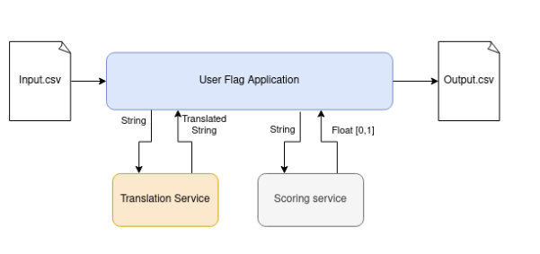

# 🛡️ User flag service

This project implements a **User flag service** for a social network, designed to identify users who post offensive or abusive messages in the comments section. The system reads user messages from a CSV file, translates them to English if necessary, scores their offensiveness, and generates a per-user report.



---

## 📌 Features

- ✅ **CSV Input** with the following columns:
  - `user_id`: Unique identifier of the user
  - `message`: Message posted by the user
- 🌐 **Simulated External Services**:
  - **Translation Service**: Translates messages to English if needed
  - **Scoring Service**: Returns a float score between `0.0` and `1.0` representing offensiveness
- 💾 **CSV Output** with the following columns:
  - `user_id`
  - `total_messages`: Total number of messages from the user
  - `avg_score`: Average offensiveness score of the user's messages
- 🧠 **Performance-Oriented**:
  - Caches repeated messages to avoid redundant service calls
  - Uses parallel processing for large datasets
- 🔁 **Idempotent Services**: Handles duplicate messages safely and efficiently
- 🧪 **Unit Test Coverage Included**

---

## 🚀 Getting Started

### Prerequisites

- Java 11 or higher
- Maven 3.6 or higher

### Clone and Build

```bash
git clone https://github.com/your-username/content-moderation-system.git
cd content-moderation-system
mvn clean install


🧪 Running Tests
To run unit tests:
mvn test
```
